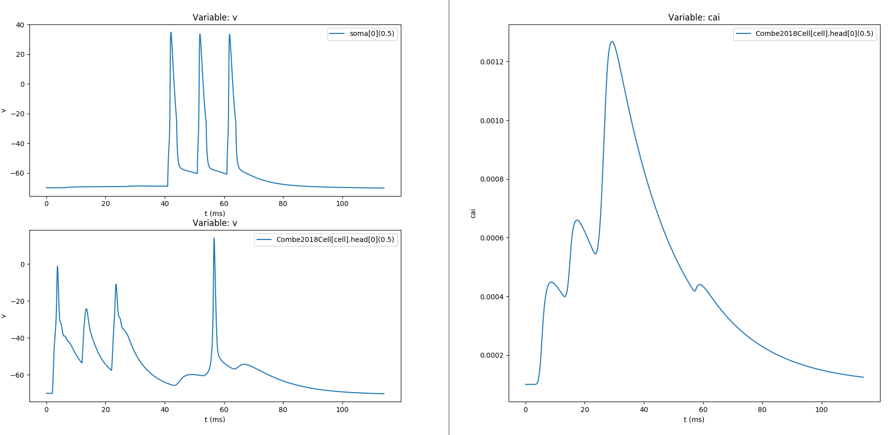
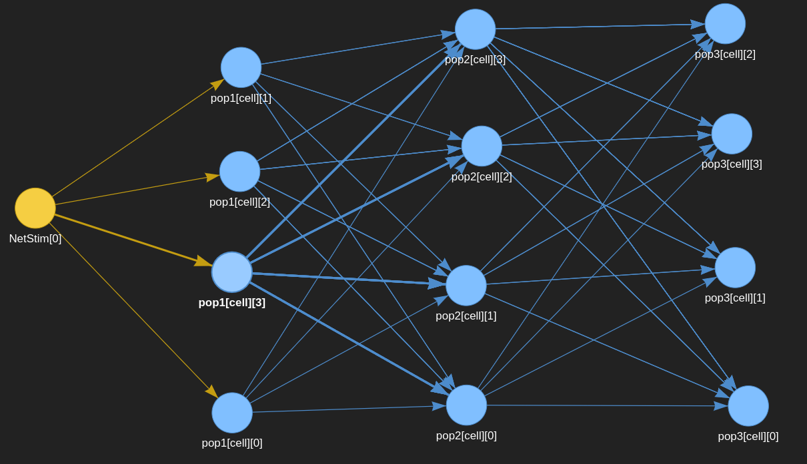

Neuron++ wraps NEURON (http://www.neuron.yale.edu) with easy to use Python objects. The main intention behind this library was to perform tedious tasks in few lines of code.

## Key features

  * Use an environment for fast prototyping of neuron models built in NEURON simulation environment using a Python interface utilizing object-oriented programming (OOP) paradigm.

  * Precisely define single cell models and connect them together to create a small network.
  
  * Upload HOC based single cell models and adapt them to your needs.
  
  * Manage synaptic signaling.
  
  * Create dendritic spines.
  
  * Define in vitro experimental protocols (eg. STDP paradigms)
  
  * Debug synaptic connections and point process RANGE values in real time.
  
  * Define populations of neurons and connect them together.
  
  * Provide helpful exception messages and guidelines of how to use NEURON functions without errors.
    
This is a pre-Alpha version

## Prerequisites

* Python 3.6
* Install NEURON from the instruction: https://github.com/ziemowit-s/neuron_netpyne_get_started
* Install requirements.txt

## Repository

https://github.com/ziemowit-s/neuronpp

## Installation

* Locally:
```bash
python setup.py bdist_wheel
```

* Through pip and GitHub:
```bash
pip install git+https://github.com/ziemowit-s//neuronpp
```
* Bear in mind that if you install the library through the pip you will have access to all features of NEURON++, however additionally provided cell models from other publications (listed below) will not work correctly, unless you download the 'commons/' folder from the repository and change paths for the relevant objects. 
* So if you want to work with those predefined models it is recommended to clone the repositoty as a whole.

## Predefined Cell models
This repository contains the basic cell model `Cell` class and the experimental 'HocCell' class which loads HOC based cell model. The repository also contains some predefined cell models from ModelDB (https://senselab.med.yale.edu/modeldb)
  * All of those models are located in the cells/ folder. 
  * If you want to create your own model it is recommended to use `Cell` class or 'HocCell' class.
  
The list of predefined cell models:
  * Ebner et al. 2019, https://doi.org/10.1016/j.celrep.2019.11.068
  * Custom implementation of Ebner et. al 2019 with ACh/DA modulation
  * Combe et al. 2018, https://doi.org/10.1523/JNEUROSCI.0449-18.2018
  * Graham et al. 2014, https://doi.org/10.1162/NECO_a_00640
  * Hay et al. 2011, https://doi.org/10.1371/journal.pcbi.1002107
  
MOD files for the all of those models are located in the commons/mods/ folder. Combe 2018 model and Graham 2014 model additionaly have HOC files located in the commons/hocmodels/ folder 

## MOD compilation
Before run you must compile mod files of your model (if it provides specialised mod features)

### Automatic (recommended)
`Cell()` object has a `compile_path` param which allows to specify paths which contain mod files to compile.

In most cases you don't need to compile files externally, if you provided appropriate pathways - it will be done automatically before each run.

### Manual

If you want to compile mods manually this is how to do it:

```bash
nrmivmodl
```

* To help with manual compilation use compile_mod.py or CompileMOD class:

  * It will compile all mods inside the source folder (you can specify many source folders)
  * copy compiled folder to the `compiled/` folder inside the target folder 
  
 ```bash
 python utils/compile_mod.py --sources [SOURCE_FOLDER_WITH_MOD_FILES] --target [TARGET_FOLDER]
 ``` 

  * By default it works on Linux but you can change default params so that they express your OS params:
    * compiled_folder_name="x86_64"
    * mod_compile_command="nrnivmodl"

## Introduction to NEURON++
The full example used in this introduction is located in: examples/basic_example.py
There are other examples in the folder.

### Basics

  * create a cell:
   ```python
    cell = Cell(name="cell")
   ```

  * load SWC/ASC or HOC morphology:
   ```python
    cell.load_morpho(filepath='commons/morphologies/asc/cell2.asc')
   ```
 
  * load HOC based cell model to the Cell object:
    * allows to work with most modelDB single cell models with the NEURON++ paradigm
    * it will auto load all sections and point processes for furher usage and/or filtering 
    * This is an experimental feature, so currently works ONLY with HOC models which define a single cell
   ```python
    cell = HocCell(name="cell")
    cell.load_hoc("your_cell_model.hoc")
   ```
   
 * if the HOC cell model is defined as a Template - just specify the 'cell_template_name' param:
 ```python
    cell = HocCell(name="cell")
    cell.load_hoc("Ebner2019_minimum_load/load_model.hoc", cell_template_name="L5PCtemplate")
   ```
   
  * create and connect sections:
   ```python
    cell.add_seg("soma", diam=20, l=20, nseg=10)
    cell.add_seg("dend", diam=2, l=100, nseg=10)
    cell.connect_secs(source="dend", target="soma")
   ```

  * add NEURON mechanisms (default or MOD-based):
   ```python
    cell.insert("pas")
    cell.insert("hh")
   ```

  * define simulation and run:
   ```python
    sim = RunSim(init_v=-65, warmup=20)
    sim.run(runtime=500)
   ```
  * add IClamp:
   ```python
   sections = cell.filter_secs("soma")
   soma = sections[0]

   ic = IClamp(segment=soma(0.5))
   ic.debug(delay=100, dur=10, amp=0.1)
   ```

### Easy filters
You can filter any part of the cell by string or regular expression filter
  
  * filter section of the cell by string:
  ```python
    # Assuming you have sections dend[0]...dend[100] it will return all of them
    sections = cell.filter_secs(name="dend")
  ```

  * filter by string separated by coma:
  ```python
    # Each coma function as OR between strings
    sections = cell.filter_secs(name="apic[1],apic[50]")
  ```

  * filter section of the cell by regular expression:
  ```python
    # Assuming you have sections dend[0]...dend[100] and apic[0]...apic[100] it will return all of them
    sections = cell.filter_secs(name="regex:(apic)|(basal)")
  ```

  * return synapses of type 'ExpSyn' located in all heads sections
   ```python
    cell.filter_synapses(mod_name="ExpSyn", name="head")
   ```

  * Whole object callable function passed to the obj_filter param.
    eg. (lambda expression) returns sections which name contains 'apic' or their distance > 1000 um from the soma:
  ```python
   soma = cell.filter_secs("soma")
   cell.filter_secs(obj_filter=lambda o: 'apic' in o.name or h.distance(soma(0.5), o(0.5)) > 1000)
  ```
         
  * Single object field filter based on callable function passed to the obj_filter param.
  eg. (lambda expression) returns sections which parent's name contains less than 10 characters
  ```python
  cell.filter_secs(parent=lambda o: len(o.parent.name) < 10)
  ```

There are many more filter functions. Check each one of them to discover each filter params.
The main cell object `Cell` contains all filter methods inside.

### Define Synapses

  * add single synapse:
   ```python
    cell = Cell(name="cell")
    soma = cell.filter_secs(name="soma")
    cell.add_sypanse(source=None, mod_name="Syn4P", seg=soma(0.5), netcon_weight=0.01, delay=1)
   ```

  * add many spines to provided sections:
   ```python
   cell = Cell(name="cell")
   dendrites = cell.filter_secs(name="dend")
   cell.make_spines(spine_number=10, head_nseg=10, neck_nseg=10, secs=dendrites)
   ```

  * add many synapses with spines (1 synapse/spine) in a single function to provided sections:
   ```python
    cell = Cell(name="cell")
    dendrites = cell.filter_secs(name="dend")
    syns = cell.add_synapses_with_spine(source=None, secs=dendrites, mod="ExpSyn",
                                        netcon_weight=0.01, delay=1, number=10)
   ```
  
  * define NetStim (or VecStim) and pass it to synapses as a source while creating:
  ```python
    netstim = NetStimCell(name="netst")
    stim = netstim.make_netstim(start=300, number=5, interval=10)
    
    cell = Cell(name="cell")
    soma = cell.filter_secs(name="soma")
    cell.add_sypanse(source=stim, seg=soma(0.5), mod_name="ExpSyn", netcon_weight=0.01, delay=1)
  ```
  
   * Make synaptic event (send external input to the synapse): 
     * every synapse can be stimulated by making event, however a good practice is to define source=None 
   ```python
    cell = Cell(name="cell")
    soma = cell.filter_secs(name="soma")
    syns = cell.add_sypanse(source=None, seg=soma(0.5), mod_name="ExpSyn", 
                            netcon_weight=0.01, delay=1)
                              
    sim = RunSim(init_v=-55, warmup=20)
    
    syns[0].make_event(10)
    syns[0].make_event(20)
    
    sim.run(runtime=100)
   ```

  * Change source to the previously created synapse:
  ```python
    synapse.add_source(source=None, weight=0.035, threshold=15, delay=2)
  ```

### Record and plot

  * make spike detector for the cell:
  ```python
    cell.make_spike_detector()

    sim = RunSim(init_v=-65)
    sim.run(runtime=500)

    cell.plot_spikes()
   ```

  * record variables from sections and point_processes:
   ```python
    # record section's voltage
    soma = cell.filter_secs(name="soma")
    rec_v = Record(soma(0.5), variables="v")

    # record synaptic (point_process) wariables (weight 'w')
    point_processes = cell.filter_point_processes(mod_name="Syn4P", name="dend")
    rec_syn = Record(point_processes, variables="w") 

    sim = RunSim(init_v=-65, warmup=20, with_neuron_gui=True)
    sim.run(runtime=500)
   ```

  * make plots and export recorded variables to CSV:
   ```python
    rec_v.plot()
    rec_syn.plot()
    plt.show()
    rec_v.to_csv("vrec.csv")
   ```
  
  * make shape plot of the cell in NEURON GUI:
   ```python
   # show 'cai' propagation in range 0-0.01 uM 
   make_shape_plot(variable="cai", min_val=0, max_val=0.01)

   # show 'v' propagation in range -70-40 mV
   make_shape_plot(variable="v", min_val=-70, max_val=40)
   ```
   
### Replicate in vitro experiments

  * define experimetal protocols, eg. STDP protocol:
  ```python
    soma = cell.filter_secs("soma")
    syn = cell.filter_synapses(tag="my_synapse")

    stdp = Experiment()
    stdp.make_protocol("3xEPSP[int=10] 3xAP[int=10,dur=3,amp=1.6]", start=1, isi=10, iti=3000,
                       epsp_synapse=syn, i_clamp_section=soma)
   ```

  * Example of the above STDP experimental protocol performed on Combe et al. 2018 cell model with custom added dendritic spines:
  https://doi.org/10.1523/JNEUROSCI.0449-18.2018
   

### Populations of neurons

[Experimental feature] Create a population of many neurons of the same type and connect them between populations or stimulate them just as any synapse (with NetStim, VecStim or event based stimulation):

  * This is an experimental feature so may not be so easy to use
  ```python
    # Define a new Population class. 
    # You need to implement abstract method cell_definition() and syn_definition() for each new Population
    import os

    path = os.path.dirname(os.path.abspath(__file__))
    class ExcitatoryPopulation(Population):
    def cell_definition(self, **kwargs) -> Cell:
        cell = Cell(name="cell")
	f_path = os.path.join(path, "..", "commons/morphologies/swc/my.swc")
        cell.load_morpho(filepath=f_path)
        cell.insert("pas")
        cell.insert("hh")
        return cell

    def syn_definition(self, cell, source, weight=1, **kwargs) -> list:
        secs = cell.filter_secs("dend")
        syns, heads = cell.add_synapses_with_spine(source=source, secs=secs, mod_name="Exp2Syn",
                                                   netcon_weight=weight)
        return syns


    if __name__ == '__main__':
        # Create NetStim
        stim = NetStimCell("stim").make_netstim(start=21, number=10, interval=10)
    
        # Create population 1
        pop1 = ExcitatoryPopulation("pop1")
        pop1.create(4)
        pop1.connect(source=stim, rule='all', weight=0.01)
        pop1.record()
    
        # Create population 2
        pop2 = ExcitatoryPopulation("pop2")
        pop2.create(4)
        pop2.connect(source=pop1, rule='all', weight=0.01)
        pop2.record()
    
        # Create population 3
        pop3 = ExcitatoryPopulation("pop3")
        pop3.create(4)
        pop3.connect(source=pop2, rule='all', weight=0.01)
        pop3.record()
    
        # Run
        sim = RunSim(init_v=-70, warmup=20)
        for i in range(1000):
            sim.run(runtime=1)
            pop1.plot(animate=True)
            pop2.plot(animate=True)
            pop3.plot(animate=True)
   ```

  * Create interactive graph of connected cells:
  ```python
  # Based on the previously created 3 populations
  make_conectivity_graph(pop1.cells + pop2.cells + pop3.cells)
  ```
 
  

### Debug synapse and point process

Debug any cell and synapse on interactive plot. 
  * By pressing a key defined as 'stim_key' param (default is w) you can stimulate synapses provided to the Debugger
  * Allows to easily plot synaptic weight (defined as MOD's RANGE variable) to see how the plasticity behaves in real time
  ```python
    cell = Cell("cell")
    soma = cell.add_seg("soma", diam=20, l=20, nseg=10)
    syn = cell.add_sypanse(source=None, mod_name="Exp2Syn", seg=soma, netcon_weight=0.1)

    debug = SynapticDebugger(init_v=-80, warmup=200)
    debug.add_syn(syn, key_press='w', syn_variables="w")
    debug.add_seg(soma(0.5))
    debug.debug_interactive()
  ```

 
Example of Ebner et al. 2019 model of synaptic weight (variable w) changing based on synaptic stimulation on demand
by pressing key "w" on the keyboard:
* variable: w - weight on the synapse.
* variable v: voltage on the soma.
* Pressing "w" on the keyboard produce a synaptic event. 


